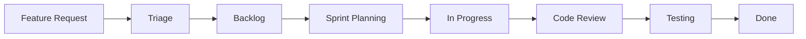
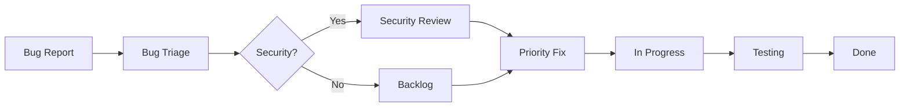
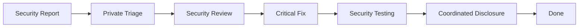

# GitHub Project Board Integration Guide

## Overview
This document outlines how to set up and use GitHub Projects for managing the MISP DDoS Automation project development workflow.

## Project Board Setup

### 1. Create New Project
1. Navigate to your GitHub profile/organization
2. Go to "Projects" tab
3. Click "New Project"
4. Choose "Team planning" template
5. Name: "MISP DDoS Automation"

### 2. Configure Project Views

#### Kanban Board View
- **Backlog**: New issues and feature requests
- **Sprint Planning**: Items being planned for next iteration
- **In Progress**: Currently being worked on
- **Code Review**: Pull requests under review
- **Security Review**: Security-related items requiring special attention
- **Testing**: Items in testing phase
- **Done**: Completed items

#### Priority View
Filter by priority labels:
- `priority:critical` - Immediate attention required
- `priority:high` - Important, should be next
- `priority:medium` - Standard priority
- `priority:low` - Nice to have

#### Component View
Filter by component:
- `component:cli` - CLI tool development
- `component:webapp` - Web application
- `component:security` - Security features
- `component:docs` - Documentation
- `component:testing` - Test suite
- `component:infrastructure` - DevOps/deployment

### 3. Custom Fields
Add these custom fields to track additional metadata:

- **Story Points**: Number field (1, 2, 3, 5, 8, 13, 21)
- **Epic**: Text field for grouping related issues
- **Security Impact**: Single select (None, Low, Medium, High, Critical)
- **Component**: Single select (CLI, WebApp, Security, Docs, Testing, Infrastructure)
- **Sprint**: Text field for sprint identification

## Automation Workflows

### Issue Automation
The GitHub Actions workflow automatically:

1. **New Issues**: Adds to project board in "Backlog" status
2. **Security Issues**: Moves to "Security Review" column
3. **Bug Reports**: Applies appropriate labels and priority
4. **Feature Requests**: Categorizes by component

### Pull Request Automation
- **New PRs**: Adds to project board in "Code Review" status
- **Security PRs**: Assigns security reviewers
- **Component PRs**: Assigns component-specific reviewers
- **Merged PRs**: Moves to "Done" status

### Label-based Automation
- **Priority Labels**: Auto-moves high priority items to top
- **Security Labels**: Triggers security review workflow
- **Bug Labels**: Moves to bug triage process

## Project Management Workflow

### Sprint Planning Process

1. **Backlog Grooming** (Weekly)
   ```
   - Review new issues in Backlog
   - Assign story points
   - Set priority labels
   - Move ready items to Sprint Planning
   ```

2. **Sprint Planning** (Bi-weekly)
   ```
   - Select items from Sprint Planning column
   - Assign to team members
   - Move to In Progress
   - Set sprint field
   ```

3. **Daily Standups**
   ```
   - Review In Progress items
   - Update status comments
   - Move blocked items appropriately
   ```

4. **Sprint Review**
   ```
   - Demo completed features
   - Move tested items to Done
   - Retrospective on process
   ```

### Issue Templates Integration

The project uses structured issue templates:

#### Feature Request Process


#### Bug Report Process


#### Security Vulnerability Process


## Project Metrics and Reporting

### Key Performance Indicators (KPIs)

1. **Velocity Tracking**
   - Story points completed per sprint
   - Burndown charts
   - Cycle time analysis

2. **Quality Metrics**
   - Bug escape rate
   - Security issues resolution time
   - Code review feedback cycles

3. **Security Metrics**
   - Security issues discovered
   - Time to security patch
   - Security review coverage

### GitHub Project Insights

Use GitHub's built-in insights to track:
- Issue creation trends
- Pull request velocity
- Contributor activity
- Label distribution

## Team Roles and Responsibilities

### Project Owner
- **Responsibilities**: Product vision, priority setting, stakeholder communication
- **GitHub Role**: Admin
- **Project Access**: Full

### Security Lead
- **Responsibilities**: Security review, vulnerability assessment, compliance
- **GitHub Role**: Maintainer
- **Project Access**: Security columns, critical issues

### Developers
- **Responsibilities**: Feature development, bug fixes, code review
- **GitHub Role**: Contributor
- **Project Access**: Development columns

### QA/Testing
- **Responsibilities**: Testing, quality assurance, release validation
- **GitHub Role**: Contributor
- **Project Access**: Testing columns

## Integration with External Tools

### MISP Integration
Track MISP-related tasks:
- API compatibility testing
- Playbook compliance validation
- Integration testing with MISP instances

### Security Tools Integration
- Dependabot for dependency updates
- CodeQL for security scanning
- Security advisory tracking

### Documentation Integration
- Wiki updates linked to issues
- README maintenance tasks
- Security documentation updates

## Project Board Maintenance

### Weekly Tasks
- Review and triage new issues
- Update issue priorities
- Clean up completed items
- Review automation effectiveness

### Monthly Tasks
- Analyze project metrics
- Review label taxonomy
- Update automation workflows
- Team retrospective

### Quarterly Tasks
- Project board structure review
- Automation performance analysis
- Team role assignments review
- Process improvement implementation

## Getting Started Checklist

- [ ] Create GitHub Project Board
- [ ] Configure project views and fields
- [ ] Set up GitHub Actions workflows
- [ ] Configure issue templates
- [ ] Assign team roles and permissions
- [ ] Create initial backlog from requirements
- [ ] Set up project metrics dashboard
- [ ] Train team on project board usage
- [ ] Establish sprint cadence
- [ ] Set up notification preferences

## Troubleshooting

### Common Issues

1. **Automation Not Working**
   - Check GitHub Actions workflow logs
   - Verify project URL in automation
   - Confirm permissions and tokens

2. **Issues Not Appearing in Project**
   - Verify repository connection to project
   - Check issue label requirements
   - Review automation trigger conditions

3. **Incorrect Status Updates**
   - Review label-based automation rules
   - Check custom field configurations
   - Verify workflow permissions

### Support Resources
- GitHub Projects Documentation
- GitHub Actions Marketplace
- Community discussions and examples

This project board integration provides a comprehensive workflow management system for the MISP DDoS Automation project, ensuring efficient development and security-focused processes.